# Free_from Image Inpainting with Gated Convolution
This result is the TensorFlow implemention of  paper 'Free_from Image Inpainting with Gated Convolution' by JiahuiYu.Thanks to JiahuiYu great work.
We all know DeepFillv1 is mainly works on rectangle mask, while this Free-From version can complete image on free-form masks.

## Introduction

1. The architecture of this free-form image inpainting network.
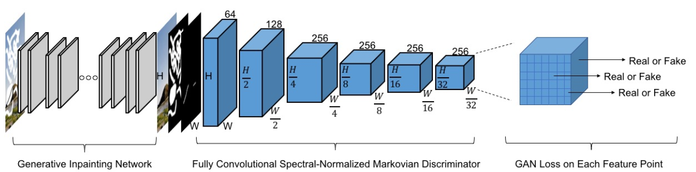
*  The key special convlution -- gated convolution.
Gated convoltion learn soft masks automatically from data. The structure is like below.

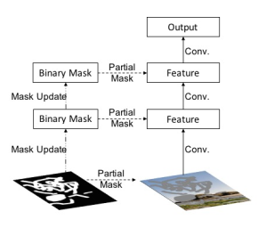

>>>>>>> 85d354830c0ae712cb5bc008c1a78672b57d54e9
*  The output of discriminator network
It‘’s called SNPatchGAN, which is more faster and stable during GAN training. But different from the hinge loss in this paper, i use 'softplus' loss, other loss function perform with 'fitness' and 'goodness' can also work.
2. Free-from mask.

&emsp;This mask is similar in shape to holes drawn in real use-cases. It looks like below.

 &emsp;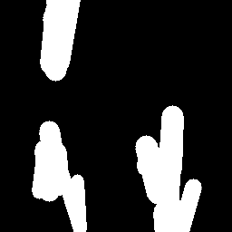
 
How to make masks, reference here: https://github.com/JiahuiYu/generative_inpainting/issues/62
3. sketch
I uses Places2 datasets, crop it too 256*256 and generate corresponding sketch.It looks like below.
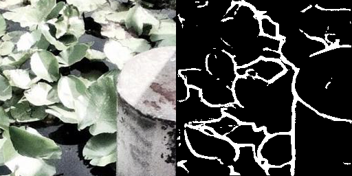
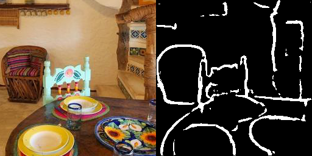

## result
This work can use for fix smudge area, or removal watermark , or removal some objects you don't want.
The first image is image with mask, the second is inpaint result, the last one is the original image.
* fix smudge area
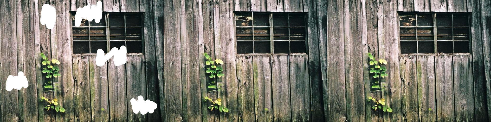
* remove watermark
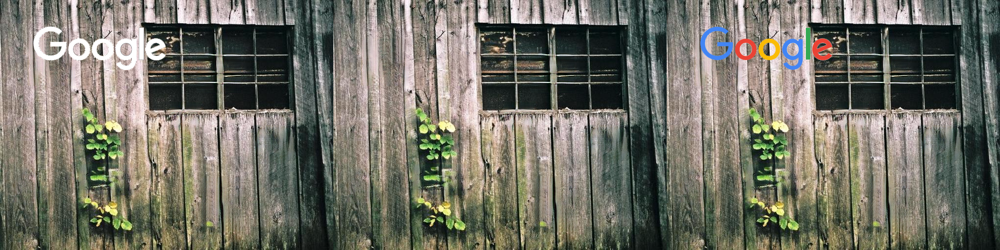
* remove some objects
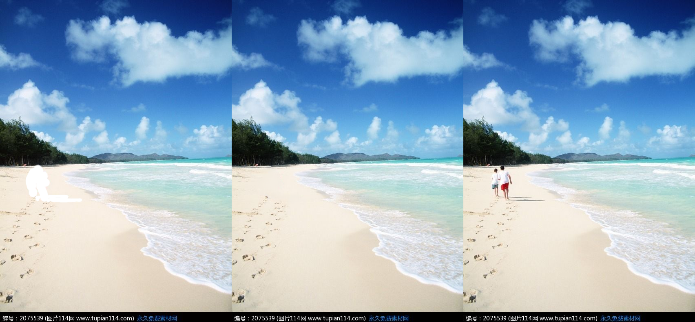

There are some other results.
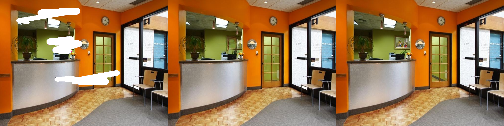
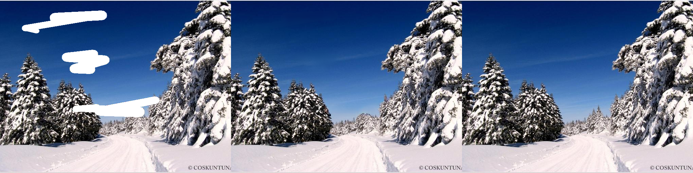
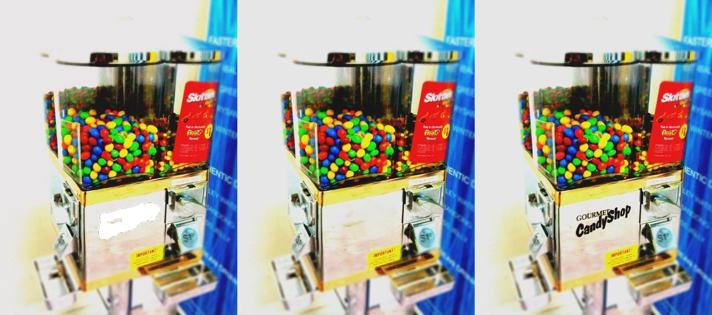
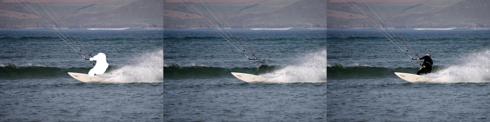
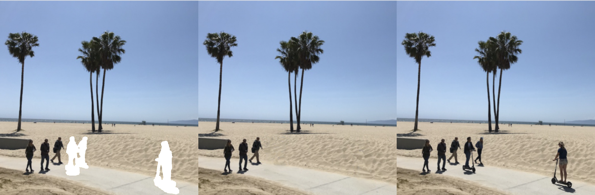
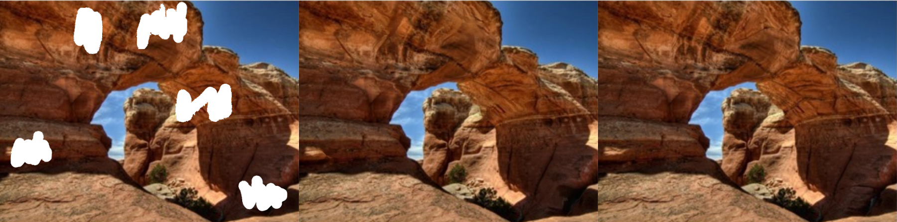
Any questions are welcome.

## Add sketch
After training sketch pairs data, I got blow results.
The first column is the input image with mask and sketch, the middle is the result, and the last one is the origin image. As we can see, sketch can help to change the shape of objects. Additionally,i found sketch very helpful to make the edge transition more natural after inpaint compare with the same mask but without sketch.

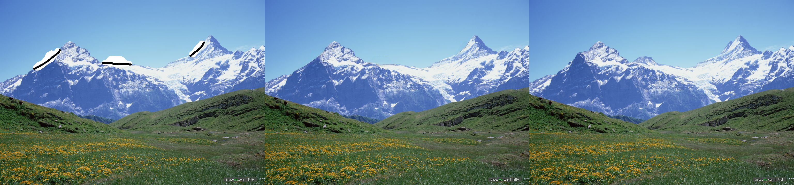

## Citing
```
@article{yu2018generative,
  title={Generative Image Inpainting with Contextual Attention},
  author={Yu, Jiahui and Lin, Zhe and Yang, Jimei and Shen, Xiaohui and Lu, Xin and Huang, Thomas S},
  journal={arXiv preprint arXiv:1801.07892},
  year={2018}
}

@article{yu2018free,
  title={Free-Form Image Inpainting with Gated Convolution},
  author={Yu, Jiahui and Lin, Zhe and Yang, Jimei and Shen, Xiaohui and Lu, Xin and Huang, Thomas S},
  journal={arXiv preprint arXiv:1806.03589},
  year={2018}
}
```

