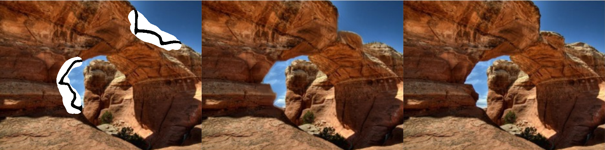
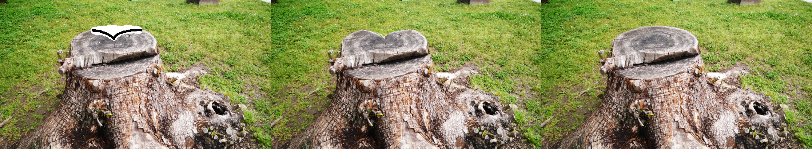

# Free_from Image Inpainting with Gated Convolution
This result is the TensorFlow implemention of  paper 'Free_from Image Inpainting with Gated Convolution' by JiahuiYu.Thanks to JiahuiYu great work.
We all know DeepFillv1 is mainly works on rectangle mask, while this Free-From version can complete image on free-form masks.

## Introduction

1. The architecture of this free-form image inpainting network.

*  Gated convolution.
Gated convoltion learns soft masks automatically from input data. The structure is like below.


*  The output of discriminator network
It‘’s called SNPatchGAN, which is more faster and stable during GAN training. But different from the hinge loss in this paper, i use 'softplus' loss, other loss function perform with 'fitness' and 'goodness' can also work.
2. Free-from mask.

&emsp;This mask is similar in shape to holes drawn in real use-cases. It looks like below.

 &emsp;
 
&emsp;How to make masks, reference here: https://github.com/JiahuiYu/generative_inpainting/issues/62

3. Make sketch

&emsp;I used Places2 datasets as train datasets, crop every train image size to 256\*256 and generate corresponding sketch by HED model. The sketch results looks like below.

&emsp;

&emsp;

## Result
This work can use for fix smudge area, or removal watermark , or removal some objects you don't want.
The first image is image with mask, the second is inpaint result, the last one is the original image.
* fix smudge area

* remove watermark

* remove some objects


There are some other results.


Any questions are welcome.

## Add sketch
After training image with sketch data, i got below results.
The first column is the input image with mask and sketch, the middle is mine result, and the last one is the original image. As we can see, sketch can help to change the shape of objects. Additionally,i found sketch can be very helpful to make the edge transition more natural after completed compare with the result with same mask but no sketch.
You click [here](https://huangqianfirst.github.io/2019/02/11/inpaint-sketch-v1/) for more discussions about 'How to make sketch work for image completion'.





## Citing
```
@article{yu2018generative,
  title={Generative Image Inpainting with Contextual Attention},
  author={Yu, Jiahui and Lin, Zhe and Yang, Jimei and Shen, Xiaohui and Lu, Xin and Huang, Thomas S},
  journal={arXiv preprint arXiv:1801.07892},
  year={2018}
}

@article{yu2018free,
  title={Free-Form Image Inpainting with Gated Convolution},
  author={Yu, Jiahui and Lin, Zhe and Yang, Jimei and Shen, Xiaohui and Lu, Xin and Huang, Thomas S},
  journal={arXiv preprint arXiv:1806.03589},
  year={2018}
}
```

